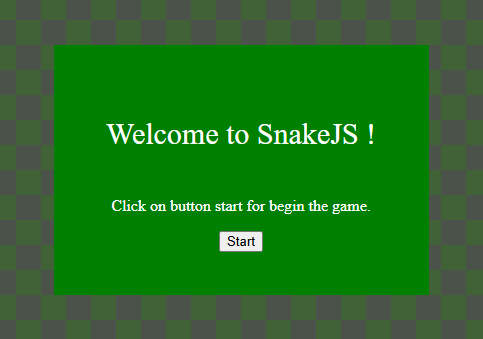
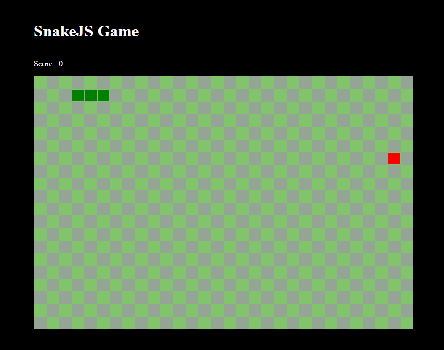

# SnakeJS

**SnakeJS** est une version simple et amusante du jeu classique Snake, développée avec HTML, CSS et JavaScript.

## Fonctionnalités

- **Gameplay classique** : Déplacez le serpent pour manger les pommes et augmentez votre score.
- **Murs traversables** : Le serpent peut traverser les murs et réapparaître de l'autre côté.
- **Game Over** : Le jeu s'arrête si le serpent se mord lui-même.
- **Pause et reprise** : Mettez le jeu en pause et reprenez-le avec la touche `Enter`.
- **Interface utilisateur simple** : Comprend un écran de démarrage et un écran de fin de partie.

---

## Comment jouer

1. **Démarrage** :
    - rendez vous sur https://swaannnn.github.io/snakejs.
    - Cliquez sur le bouton **Start** pour lancer le jeu.

2. **Contrôles** :
    - Utilisez les touches fléchées pour déplacer le serpent :
        - `↑` Haut
        - `↓` Bas
        - `←` Gauche
        - `→` Droite
    - Appuyez sur `Enter` pour mettre le jeu en pause ou reprendre.

3. **Objectif** :
    - Mangez les pommes rouges pour augmenter votre score.
    - Évitez de vous mordre pour continuer à jouer.

4. **Fin de partie** :
    - Si le serpent se mord lui-même, l'écran **Game Over** s'affiche.
    - Cliquez sur **Restart** pour recommencer.

---

## Captures d'écran

---

## Structure des fichiers

### `index.html`
- Contient la structure HTML du jeu.
- Intègre le canvas pour le jeu et les éléments d'interface (score, écran de démarrage, écran de fin).

### `style.css`
- Définit le style de l'interface utilisateur et des éléments du jeu.
- Utilise un design simple avec des couleurs contrastées.

### `index.js`
- Contient la logique du jeu :
    - Gestion du canvas.
    - Déplacement du serpent.
    - Apparition et gestion des pommes.
    - Gestion des collisions.
    - Contrôles clavier.
    - Boucle principale du jeu.

---

## Auteur

Développé par Swaannnn.

